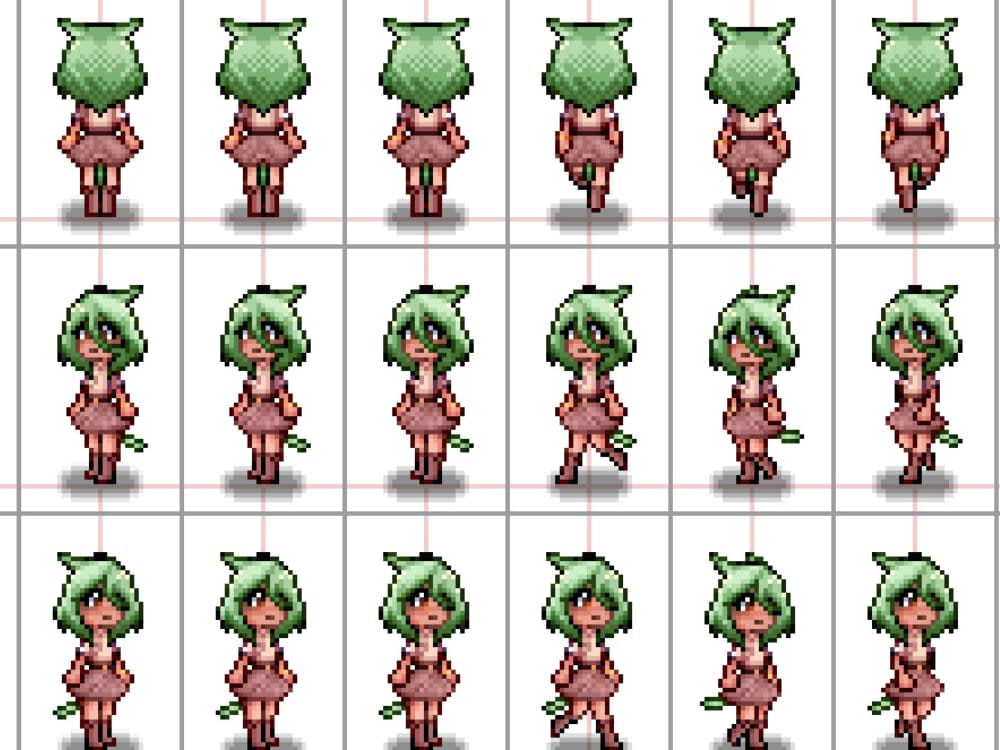

# 🎮 Práctica 7: Animación Direccional con Sprite Sheet (Pygame)

## 🎯 Objetivo
Aprender a **cargar y animar un personaje desde una hoja de sprites (sprite sheet)** con movimiento en varias direcciones.

---

## 🧠 Conceptos a aprender

| Concepto | Descripción |
|-----------|--------------|
| **Sprite Sheet** | Imagen que contiene varias animaciones o direcciones del personaje. |
| **Subsurface** | Permite cortar una región específica del sprite sheet. |
| **Diccionario de animaciones** | Se usa para guardar las secuencias de cada dirección. |
| **Movimiento por teclado** | Detectar flechas para cambiar dirección y posición. |
| **Clock.tick()** | Controla la velocidad de actualización del juego. |

---

## 🖼️ Imagen base

Usaremos una imagen como la siguiente (guárdala en la carpeta del proyecto con el nombre `personaje_direcciones.png`):



📏 **Estructura de la imagen:**
- 4 filas (una por dirección)
- 4 columnas (fotogramas por animación)
- Cada cuadro tiene un tamaño de **64x64 píxeles**

---

## 🧱 Estructura del proyecto

+ mi_juego/
    - │

        - ├── personaje_direcciones.png

        - └── animacion_direccional.py


---

## ⚙️ Funciones clave

| Función | Descripción |
|----------|-------------|
| `pygame.image.load()` | Carga una imagen. |
| `Surface.subsurface(Rect)` | Recorta una parte de la imagen (para obtener cada frame). |
| `pygame.time.get_ticks()` | Devuelve el tiempo en milisegundos desde que inició el programa. |
| `Clock.tick(fps)` | Controla los cuadros por segundo del bucle principal. |

---

## 🧩 Actividades sugeridas

Cambia el tamaño del personaje y ajusta FRAME_ANCHO / FRAME_ALTO.

- Agrega una animación de “quieto” (idle) cuando no se mueve.

- Crea un fondo con una imagen (fondo.png).

- Añade límites para que el personaje no salga de la pantalla.

- (Avanzado) Agrega una animación de ataque al presionar la barra espaciadora.

## 🌟 Resultado esperado

- El personaje se moverá con las flechas del teclado y cambiará su animación según la dirección.
- Se verá como si caminara en distintas direcciones de forma fluida.

## 🧠 Preguntas de repaso

- ¿Qué función usamos para recortar una parte del sprite sheet?

- ¿Cómo controlamos la velocidad de animación?

- ¿Por qué usamos un diccionario de animaciones en lugar de una sola lista?

- ¿Qué ventaja tiene usar pygame.time.get_ticks()?
---
## 💻 Código base: `animacion_direccional.py`

```python
import pygame
pygame.init()

# --- Configuración ---
ANCHO, ALTO = 640, 480
VENTANA = pygame.display.set_mode((ANCHO, ALTO))
pygame.display.set_caption("Animación Direccional - Sprite Sheet")

# --- Cargar Sprite Sheet ---
sprite_sheet = pygame.image.load("personaje_direcciones.png").convert_alpha()

FRAME_ANCHO = 64
FRAME_ALTO = 64
FILAS = 4       # Una fila por dirección
COLUMNAS = 4    # Cuatro fotogramas por fila

# --- Función para extraer los cuadros de una fila ---
def obtener_frames(fila):
    frames = []
    for i in range(COLUMNAS):
        rect = pygame.Rect(i * FRAME_ANCHO, fila * FRAME_ALTO, FRAME_ANCHO, FRAME_ALTO)
        frame = sprite_sheet.subsurface(rect)
        frames.append(frame)
    return frames

# --- Diccionario con las animaciones de cada dirección ---
animaciones = {
    "arriba": obtener_frames(0),
    "izquierda": obtener_frames(1),
    "abajo": obtener_frames(2),
    "derecha": obtener_frames(3)
}

# --- Variables de juego ---
x, y = ANCHO // 2, ALTO // 2
velocidad = 3
direccion = "abajo"
frame_index = 0
ultimo_tiempo = pygame.time.get_ticks()
tiempo_animacion = 150  # milisegundos entre cuadros
reloj = pygame.time.Clock()

# --- Bucle principal ---
ejecutando = True
while ejecutando:
    for event in pygame.event.get():
        if event.type == pygame.QUIT:
            ejecutando = False

    # --- Movimiento y dirección ---
    teclas = pygame.key.get_pressed()
    moviendo = False

    if teclas[pygame.K_UP]:
        y -= velocidad
        direccion = "arriba"
        moviendo = True
    elif teclas[pygame.K_DOWN]:
        y += velocidad
        direccion = "abajo"
        moviendo = True
    elif teclas[pygame.K_LEFT]:
        x -= velocidad
        direccion = "izquierda"
        moviendo = True
    elif teclas[pygame.K_RIGHT]:
        x += velocidad
        direccion = "derecha"
        moviendo = True

    # --- Actualizar animación ---
    ahora = pygame.time.get_ticks()
    if moviendo:
        if ahora - ultimo_tiempo > tiempo_animacion:
            frame_index = (frame_index + 1) % len(animaciones[direccion])
            ultimo_tiempo = ahora
    else:
        frame_index = 0  # quieto muestra primer frame

    # --- Dibujar ---
    VENTANA.fill((90, 150, 255))
    VENTANA.blit(animaciones[direccion][frame_index], (x, y))
    pygame.display.flip()
    reloj.tick(60)

pygame.quit()
```